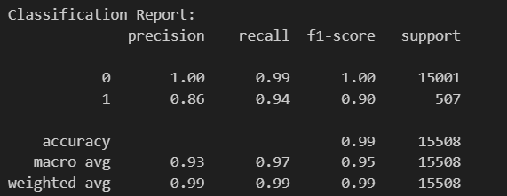

# credit-risk-classification
Supervised Learning

#Purpose

Is to create a model using the logistic regression which is able to predicts the likelihood of a loan defaulting (high risk).
This model must be based on several factors. Using this model will help us understand the the likehood of defaulting or not. 

#Results:

#Summary
Main metrics
Accuracy: The model correctly classifies?
Precision and Recall: What is the performance of the model? Does it work for predictin defualt or healthy loans.
Based on the results, the model is very good and recommended to use to identify loan status.  the accuracy, precision and recall prove it. 